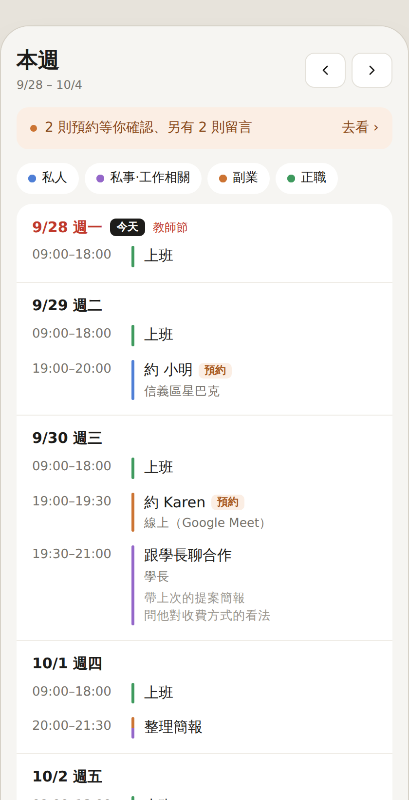
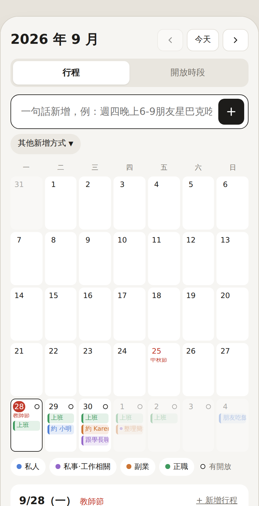
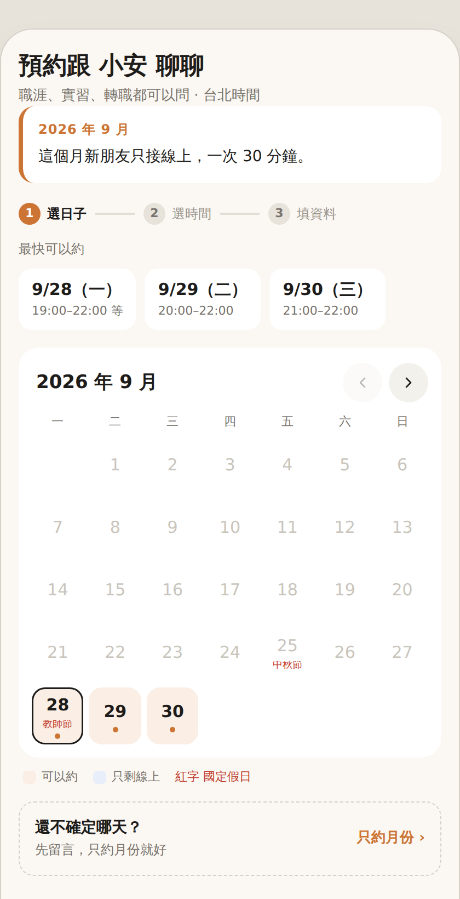
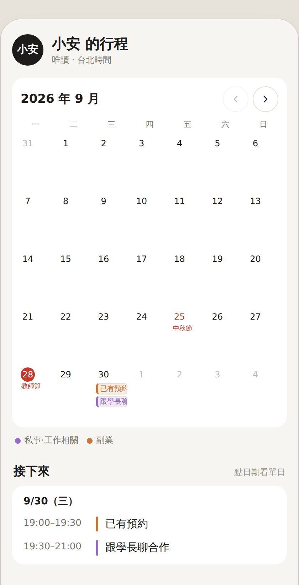

# 一個人的行事曆與預約系統

**▶︎ [線上試玩（不用安裝，不會碰到你的 Google 帳號）](https://<你的帳號>.github.io/calendar-booking-gas/demo/)**

用 Google Apps Script 做的個人排程工具：**自己的行程分類管理**＋**給別人預約你時間的網頁**。
不用伺服器、不用資料庫、不用付費，全部跑在你自己的 Google 帳號裡：行程存在 Google 日曆，設定和預約紀錄存在 Google 試算表。

> 這是我自己在用的東西，整理後開源。歡迎 fork、改成你要的樣子。

| 本週 | 月曆 | 預約頁 | 分享行程 |
|---|---|---|---|
|  |  |  |  |

## 這個系統能做什麼

**你自己的後台（只有你打得開）**

- **本週**：這週每天的安排一頁看完，可以隱藏不想看的行事曆（例如「正職」），下面有 8 格白板寫不限時的待辦，可打勾、可清掉
- **月曆**：一句話新增行程（「星期5下午三點-6:00跟家人吃飯」會自動拆成日期、時間、對象、分類），也有手動新增、每週固定活動、整批匯入
- 一筆行程可以同時屬於多本行事曆、可以寫備註、可以自動建立 Google Meet、可以選擇「讓家人看到」（複製一份到家庭日曆）
- **開放時段**：在月曆上點日期（可多選），設定幾點到幾點開放、線上或實體、給朋友還是給新朋友
- **收件匣**：所有預約和留言的紀錄，新朋友的預約可以按「通過」或「婉拒」

**對外的三條連結**

| 連結 | 給誰 | 重點 |
|---|---|---|
| 朋友連結 | 私下傳給朋友 | 帶密鑰，外流可以重設 |
| 新朋友連結 | 放 IG、名片、網站 | 任何人都能開，必填 Email，可設定要你審核才成立 |
| 分享行程 | 想給誰看就給誰 | 唯讀月曆，只顯示你勾選要分享的行事曆；別人的預約只會顯示「已有預約」 |

對方在你開放的時段裡自己選幾點到幾點（30 分鐘為單位），送出後自動寫進你的 Google 日曆、寄通知信給你、記進試算表。

**其他**

- 台灣國定假日標紅字（2026/9–2027/12，資料來自行政院人事行政總處）
- 每個月可以寫一段話顯示在預約頁最上面，朋友和新朋友分開寫
- 手機優先的介面，可以加到手機主畫面當 App 用

## 先玩玩看

`demo/index.html` 是完整的模擬版，**下載後用瀏覽器打開就能玩**，不會碰到任何真的 Google 帳號或日曆。裡面可以切換後台、朋友頁、新朋友頁、分享頁和收到的通知信。

也可以直接開這個網址：<https://<你的帳號>.github.io/calendar-booking-gas/demo/>

## 安裝

需要一個 Google 帳號（免費的 gmail 就可以），全程在瀏覽器完成，大約 20 分鐘。

完整步驟看 **[docs/安裝與部署.md](docs/安裝與部署.md)**，摘要：

1. 到 [script.google.com](https://script.google.com) 開新專案，把 `apps-script/` 裡的 8 個檔案貼進去
2. 執行一次 `setup`（會自動建立行事曆和試算表）
3. 部署兩個網頁應用程式：一個給外人（存取選「所有人」）、一個給自己（存取選「只有我自己」，網址後面加 `?admin`）
4. 進後台設定：對外網址、你的名字、預約進來放哪本行事曆

日常怎麼用看 **[docs/使用手冊.md](docs/使用手冊.md)**。

## 架構

```
apps-script/
  Code.gs          後端：空檔計算、預約、審核、收件匣、白板、權限
  appsscript.json  專案設定（時區、Google Calendar 進階服務）
  Admin.html       後台（本週／月曆／收件匣／設定）
  Book.html        朋友與新朋友的預約頁
  Share.html       分享行程的唯讀頁
  Styles.html      共用樣式
  Parser.html      一句話解析、整批匯入的文字解析
  Cal.html         台灣國定假日資料
demo/              瀏覽器上的模擬版（mocks.js 模擬 Google 服務，build.js 打包成 index.html）
test/             Node 測試（node test/test4.js 之類）
docs/             安裝、使用手冊
```

資料放在哪：

- **行程** → 你 Google 日曆裡的那幾本行事曆
- **預約紀錄** → 試算表「預約系統」的「收件匣」工作表
- **設定**（開放時段、連結密鑰、每月的話…）→ 同一份試算表的隱藏工作表 `_設定`，一格 JSON
- **白板** → 隱藏工作表 `_白板`

沒有任何資料離開你的 Google 帳號，也沒有第三方服務。

## 開發

```bash
# 改完 apps-script/ 之後，重新打包模擬版
cd demo && node build.js      # 產生 demo/index.html

# 跑測試（需要 Node 18+）
TZ=Asia/Taipei node test/test4.js
TZ=Asia/Taipei node test/test5.js
TZ=Asia/Taipei node test/test6.js
TZ=Asia/Taipei node test/test7.js
```

測試用 `test/mock.js` 假造 Google 的服務，直接把 `Code.gs` 跑起來，不會碰到真的日曆。

## 已知限制

- Apps Script 閒置後第一次開需要 2–4 秒暖機
- 對外頁面上方會有一行 Google 的灰色小字，免費帳號拿不掉
- IG、Threads 等 App 的內建瀏覽器可能擋掉頁面，頁面上會出現「用瀏覽器開啟」的提示
- 免費帳號每天寄信上限約 100 封
- 瀏覽器同時登入多個 Google 帳號時，後台可能打不開（Google 的已知問題），用無痕視窗或單一帳號的瀏覽器即可
- 國定假日資料只到 2027/12，之後要自己更新 `Cal.html`
- 介面是繁體中文寫死的，要其他語言得自己改字串

## 授權

MIT，看 [LICENSE](LICENSE)。用得開心，出事自負，不附保固。
